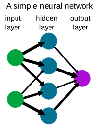
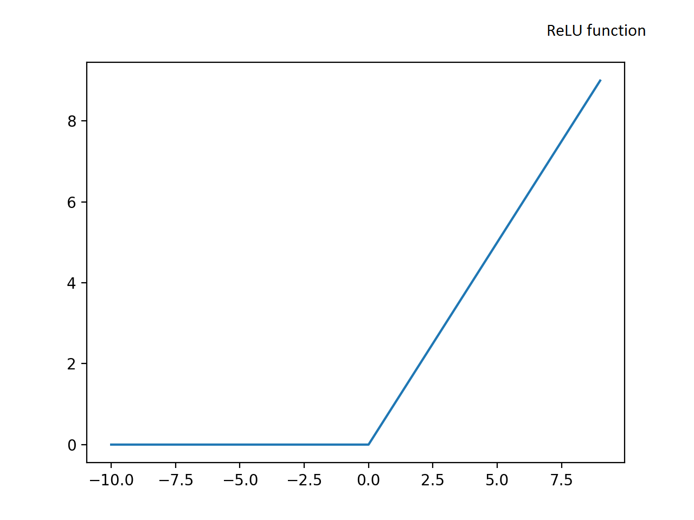
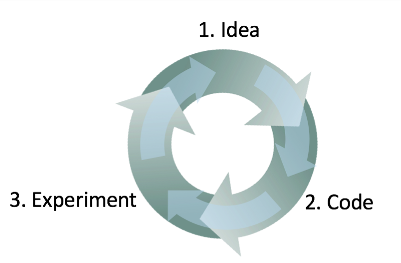

# Introduction to Deep Learning

## What is a neural network?

>source: https://upload.wikimedia.org/wikipedia/commons/9/99/Neural_network_example.svg

The neural network is a computational learning system that uses a network of functions (a ReLu function most of the time) to understand and translate a *data input* into a *desired output*.

The job of the neural network is to *map the input to the output*.

The hidden layer and the input layer are *densly connected*.

## Supervised Learning with Neural Networks
Supervised learning is a type of machine learning.

Neural networks have been proven to be most useful in **supervised learning**.

In supervised learning, we want to create a function that maps some input x to some output y.

There are several types of neural networks, such as: Standard NNs, CNNs (Convolutional Neural Network) for image applications, 
RNNs(Recurrent Neural Network) for sequence data such as audio & language, Hybrid/Custom NNs.

Data may be
- **Structured Data**: comprised of clearly defined data types whose pattern makes them easily searchable. Features in the database (such as Age, Gender, ..) has a defined meaning.
- **Unstructured Data**: comprised of data that is usually not as easily searchable, including formats like audio, video, and social media postings.
>source: https://www.datamation.com/big-data/structured-vs-unstructured-data.html#:~:text=Structured%20data%20vs.,video%2C%20and%20social%20media%20postings.

## Why is Deep Learning taking off ?
1. **More Data** due to digitilization, sensors, ..
2. **Larger Computational Power** 
3. **Algorithm Innovation** that aim to make NNs run faster. Such as switching from a sigmoid function to a ReLU function which has made the Gradient Descent algorithm work faster.

>source: https://www.researchgate.net/figure/An-illustration-of-the-signal-processing-in-a-sigmoid-function_fig2_239269767

>source: https://machinelearningmastery.com/rectified-linear-activation-function-for-deep-learning-neural-networks/

When the algorithm runs faster, it allows to train bigger NNs.

Fast computation helps in improving the NNs as practitioners of NNs get the results of their experiments much faster.

>source: https://medium.com/in-pursuit-of-artificial-intelligence/choosing-a-deep-learning-framework-5669a85ebc3f