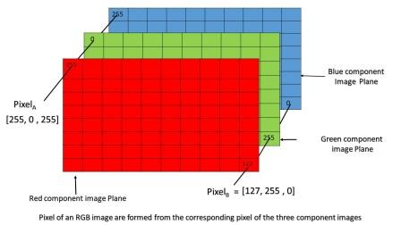
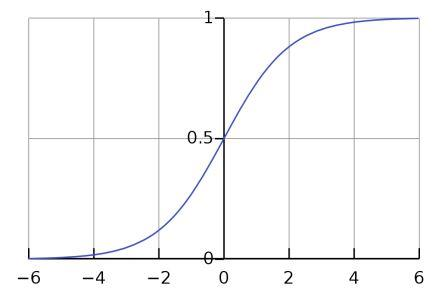
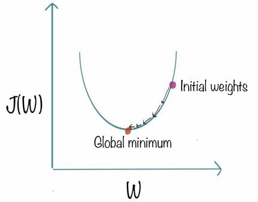
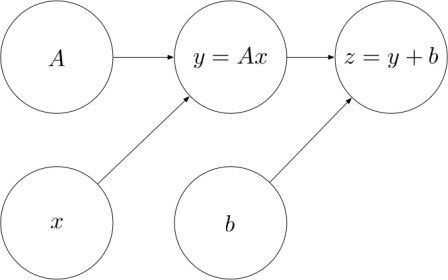
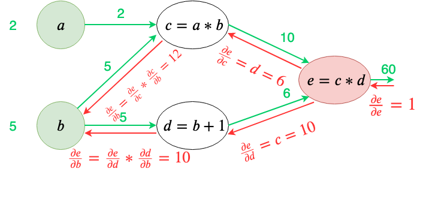
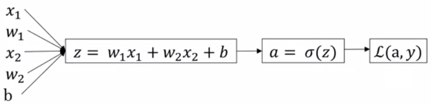

# Logistic Regression as a Neural Network

## Binary Classification
- An example of binary classification: 
  - *Input:* Image (X) &rarr; Three 64X64 matrices (**feature** vectors) denoting the pixel intensity of red, green and blue in the image.
The dimension of the input feature x (denoted **nx**) will be 64X64X3 = 12288
  - *Output:* A **label** (y) that denotes 1 for cat image and 0 for not a cat image

>img src: https://www.geeksforgeeks.org/matlab-rgb-image-representation/

- In binary classification the value of y is *always 0 or 1*.
- A single training example is represented by the pair **(x, y)**
- The training set consists of **m** training examples: (x1, y1) to (xm, ym)
- **Mtrain** or **m** &rarr; the number of training samples
- **Mtest** &rarr; the number of test examples
- The matrix **X** = [x1; x2;..... xm]
  - It consists of m columns and height nx
  - To find the shape of the matrix in Python use the command **X.shape** = (m, nx)
- The matrix **Y** = [y1 y2 ..... ym]
  - Y.shape = (1, m)
 
## Logistic Regression
- Logistic Regression is the algorithm for binary classification.
- Given an input x, we want the algorithm to estimate output **ŷ** which is *the probability that y=1* 
- The goal is ŷ ≈ y
- Its parameters are:
  - W: &rarr; dimension nx
  - b: a real number
- A linear function to relate x to ŷ 
  - ŷ = wT \* x + b *(N.B. T means transpose)*
  - Used in linear regression, but **doesn't work** on binary classification problems
- The logistics regression function is **ŷ = σ (wT * x + b)**
- The sigmoid funtction **σ(z) = 1/(1 + e-z)**

>img src: https://en.wikipedia.org/wiki/Sigmoid_function

- It's required to find `w` and `b` to find a good estimate of `ŷ`
- A **cost function** is needed to find `w` and `b`

## Logistic Regression Cost Function
- We'll use this function to measure how good the estimate `ŷ` is to the true label `y`
- A possible loss function is the square root error:
  - L(ŷ, y) = 0.5 (ŷ - y)2 
  - This contains local optimum points, so we will not use it.
- The loss function that we will be using is:
  - It measures how well the estimate is in **one** training example.
  - **L(ŷ, y) = - (y log(ŷ) + (1 - y) log(1 - ŷ))**
    -  *We always want the loss to be as small as possible*
    -  *** If y = 1: *** 
       -  L(ŷ, y) = - y log(ŷ) 
       -  ∴ we want y log(ŷ) to be as large as possibe 
       -  ∴ we want `ŷ` to be large 
       -  `ŷ` is a sigmoid function so its largest possible value is 1
    -  *** If y = 0: *** 
       -  L(ŷ, y) = - log(1 - ŷ) 
       -  ∴ we want log(1 - ŷ) to be as large as possibe 
       -  ∴ we want `ŷ` to be small 
       -  `ŷ` is a sigmoid function so its smallest possible value is 0
- A **cost function** determines the estimate is in the **entire** training set
  - **J(w, b) = 1/m Σ L(ŷ(i), y(i))**
  - It's the average of the loss function values of each training examples.
  - It's **convex** (i.e. it has one optimum point)
  
## Gradient Descent
-  It will be used to train the parameters `w` and `b` to *find the cost function's global minimum*.
-  The function's initial value is usually 0.
-  It will always be able to find the cost function's global optimum since the cost function is convex.
- The algorithm works as follows :
    Repeat {
   
     w = w - α [∂J(w, b)/∂(w)];
   
     b = b - α [∂J(w, b)/∂(b)];
 
   }

>img src: https://www.kdnuggets.com/2018/06/intuitive-introduction-gradient-descent.html

  -  **`α`** is the learning rate, on it depends the step taken in each iteration in the gradient descent
  -  **`dw`** will be used in coding as an acronym for *∂J(w, b)/∂(w)*
  -  **`db`** will be used in coding as an acronym for *∂J(w, b)/∂(b)*
  
## Derivatives

-  Slope (Derivative ) = height / width 
-  In a straight line function, the gradient is constant

## More Derivative Examples
-  The slope of the function can differ at each point in the function
-  if f(a) = a2 &rarr; d(f(a))/d(a) = 2 a
-  if f(a) = a3 &rarr; d(f(a))/d(a) = 3 a
-  if f(a) = ln(a) &rarr; d(f(a))/d(a) = 1/a

## Computation Graph
-  The computations of a neural network are organized in terms of a * forward pass * in which we compute the o/p of the network followed by a * backward pass * in which we use to compute derivatives.
-  This graph is used in optimization - for the cost function in logistic regression
-  The following image is of a left to right computation (forward pass)

>img src: https://colah.github.io/posts/2015-08-Backprop/

## Derivatives with a Computation Graph

>img src: https://towardsai.net/p/machine-learning/nothing-but-numpy-understanding-creating-neural-networks-with-computational-graphs-from-scratch-6299901091b0

- When coding, there will be a **Final Output Variable** that you are seeking to compute its derivative with respect to another variable: 
**`dFinalOutputVar/dvar`**, but dFinalOutputVariable is too long so instead use **`dvar`**, example **∂a &rarr; ∂e/∂a**

## Logistic Regression Gradient Descent

-  Use computation graphs to *derive logistics regression*.
-  **Recap**:
   -  z = wT * x + b
   -  ŷ = a = σ(z)
   -  L(a, y) = - (y log(a) + (1 - y) log(1 - a))
-  Example:

>img src: https://www.coursera.org/learn/neural-networks-deep-learning/lecture/5sdh6/logistic-regression-gradient-descent

  -  ∂L(a, y)/∂a = da = -(y/a) + ((1-y)/(1-a))
  -  ∂L(a, y)/∂z = dz = [∂L(a, y)/∂z] \* [∂a/∂z] = [-(y/a) + ((1-y)/(1-a))] \* [a(1-a)] = 1 - y
  -  dw1 = x1 \* dz
  -  dw2 = x2 \* dz
  - db = dz