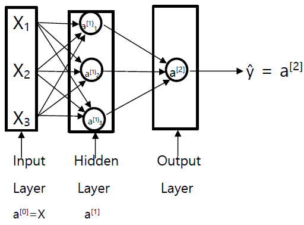

# Shallow Neural Network
## Neural Networks Overview

## Neural Network Representation
NN with a **single** hidden layer.

This is called a 2 layer NN - we don't count the input layer (called layer 0).

The hidden layer has associated with parameters w[1] and b[1].

The output layer has associated with parameters w[2] and b[2].

a[1] = [a[1]1; a[1]2; a[1]3] &rarr; 3 dimensional because the NN's hidden layer has 3 hidden units.

## Computing a Neural Network's Output